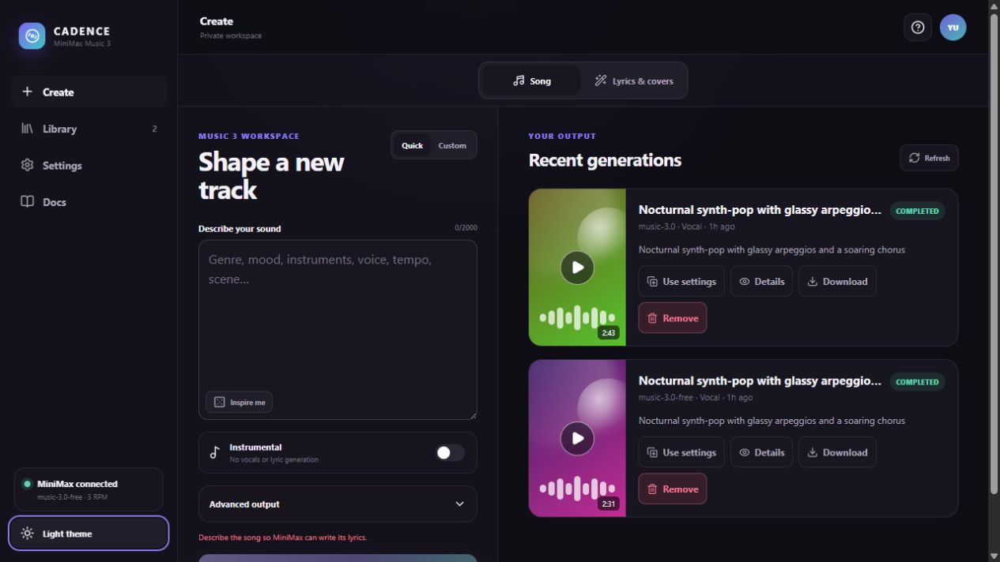
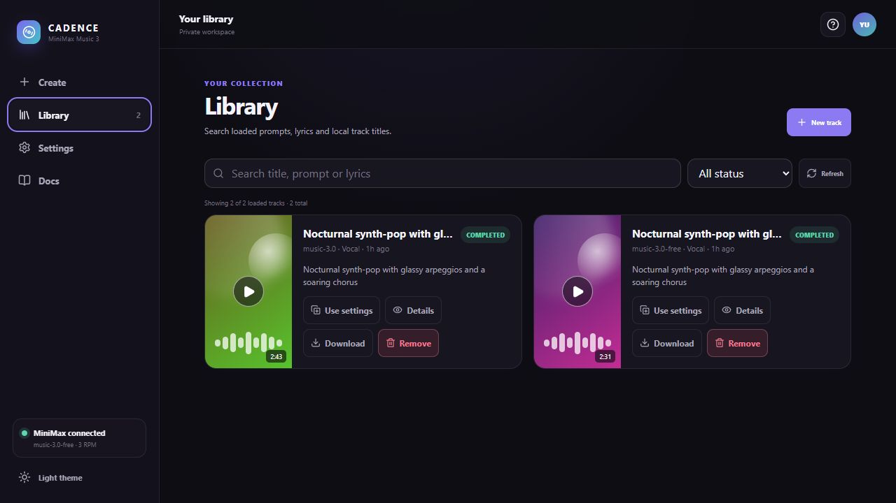
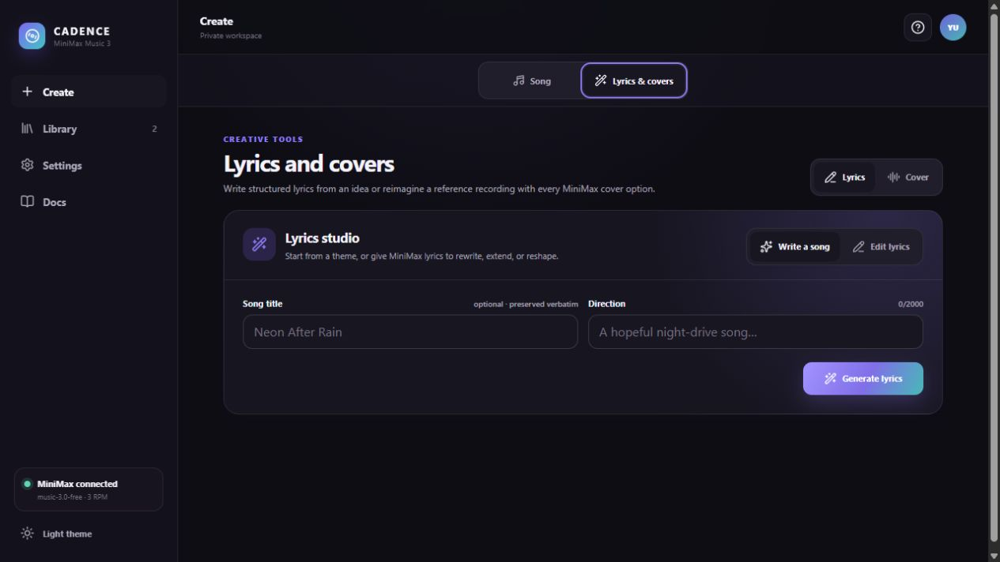

# Cadence

Cadence is a local-first web studio for MiniMax Music 3. It combines a focused composer, durable
generation history, detailed parameter inspection, downloads, and a persistent audio player in an
original light/dark interface inspired by the workflow patterns of modern music tools.

"Local-first" refers to history and generated audio being kept on your machine. Music generation is
not offline: prompts, lyrics, and cover references are sent to MiniMax. Cadence currently has no
authentication and is intended for a trusted, single-user localhost; do not expose it directly to
the public internet.

## Screenshots



| Library                                                                        | Lyrics and covers                                                                  |
| :----------------------------------------------------------------------------- | :--------------------------------------------------------------------------------- |
|  |  |

## Launch with Docker

1. Copy `.env.example` to `.env` and set `MINIMAX_API_KEY`.
2. Start the stack:

   ```sh
   docker compose up --build
   ```

3. Open [http://localhost:4321](http://localhost:4321).

Set `APP_PORT` in `.env` before starting the stack if port `4321` is already in use.

Stop it with `docker compose down`. The Compose-managed data volume declared as `music_data` keeps
the SQLite database and generated audio between launches. Running `docker compose down -v` also
removes that project-scoped volume and permanently deletes local history and audio.

The API key is injected only into the Deno API container. It is never bundled into the Astro
frontend, returned by an endpoint, or stored with generation records.

## Deno development workflow

Deno owns the root task runner, API runtime and dependencies, formatting, linting, API type
checking, and both coverage gates. Astro 7's checker and renderer use internal `astro:` virtual
modules that do not currently run through Deno's `npm:` compatibility layer, so the frontend
check/dev/build commands use an isolated, locked pnpm install. There is no npm workflow.

```sh
deno install --frozen
deno task setup:web # pnpm install for Astro only
deno task dev:api   # terminal 1, reads .env
deno task dev:web   # terminal 2, http://localhost:4321
```

Local development requires Deno 2.9+ and Node >=22.13 <25 with Corepack; Node 24.19 is the pinned
and recommended Docker version. The frontend manifest pins pnpm 11.21.0. The one-click Docker launch
installs that toolchain inside its build stage, so only Docker is needed on the host.

Useful checks:

```sh
deno task fmt
deno task lint
deno task check
deno task test
deno task build
deno task verify    # all of the above as one release gate
```

With the Docker stack already running, `deno task smoke:live` performs a real MiniMax request. It
creates a track and consumes provider quota, so it is intentionally excluded from `verify`.

## What is implemented

- MiniMax `music-3.0-free` and `music-3.0` text-to-music generation
- quick auto-lyrics, dedicated full-song lyric generation/editing, custom lyrics, and instrumentals
- one-step URL/upload covers and two-step preprocess/edit/generate covers
- all documented Music 3 audio settings: format, sample rate, and bitrate
- a sequential queue respecting the free model's 3 RPM limit; queued work survives restarts, while
  an interrupted in-flight request is marked failed for explicit retry
- local history with status, prompt, lyrics, settings, errors, trace ID, and internal retry lineage
- immediate download of MiniMax's 24-hour result URL into owned local storage
- same-origin, tenant-scoped media delivery with HTTP byte ranges for seeking
- a paginated library with client-side search and status filtering of loaded results, parameter
  reuse, retry, rename, removal, details, and correctly named downloads
- browser playback for MP3 and WAV results; PCM output remains available for download
- tenant-scoped database queries and media paths, with a fixed local tenant until authentication is
  added
- responsive desktop/mobile layouts and persistent light/dark theme

The Music API does not expose separate BPM, key, seed, duration, voice, genre, negative-prompt, or
generation-count parameters. Put those musical directions in the sound description. One MiniMax
request currently returns one track.

Cover generation uses separate `music-cover-free` and `music-cover` models so the normal Music 3
composer remains focused on text-to-song generation. Cover reference inputs remain private worker
data and are never returned by history or detail endpoints.

## Architecture

```text
Browser
  └─ Astro + React static UI (nginx, :4321)
       └─ /api proxy
            └─ Deno + Hono API (:8787, internal)
                 ├─ SQLite metadata (/data/music.db)
                 ├─ tenant-scoped audio (/data/audio/...)
                 └─ MiniMax Music API
```

The `AudioStorage` interface isolates filesystem persistence so an S3-compatible backend such as
RustFS can be added later without changing generation or API code. RustFS is not deployed yet
because a named local volume is simpler and more reliable for one user.

See [docs/API.md](docs/API.md) for the exact MiniMax/API contract and
[docs/ARCHITECTURE.md](docs/ARCHITECTURE.md) for persistence and extension notes.

## Local API

| Method   | Path                         | Purpose                                           |
| -------- | ---------------------------- | ------------------------------------------------- |
| `GET`    | `/api/health`                | container health                                  |
| `GET`    | `/api/config`                | safe client capabilities; never returns the key   |
| `POST`   | `/api/lyrics`                | generate, edit, or continue structured lyrics     |
| `POST`   | `/api/covers/preprocess`     | extract a cover feature ID and editable lyrics    |
| `GET`    | `/api/generations`           | tenant history (`limit`, `offset`, `q`, `status`) |
| `POST`   | `/api/generations`           | persist and enqueue a track or cover              |
| `GET`    | `/api/generations/:id`       | generation details                                |
| `PATCH`  | `/api/generations/:id`       | rename the local track                            |
| `DELETE` | `/api/generations/:id`       | remove completed/failed metadata and stored audio |
| `POST`   | `/api/generations/:id/retry` | create an explicit linked retry                   |
| `GET`    | `/api/generations/:id/audio` | tenant-scoped audio with Range support            |
